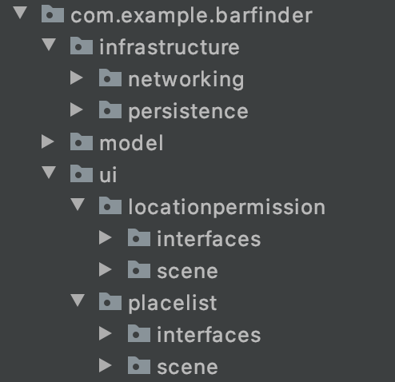

# Bar Finder

This sample Android app is made using **Kotlin** and **Clean Architecture**.
The objective is to implement a **Bar/Cafe/Restaurant Finder** using the [Google Places Search API](https://developers.google.com/maps/documentation/places/web-service/search)
The app has only two screens: 
   * The **Places List** screen
   * The **Location Permission** asking screen

We are using Gradle as dependency manager and the following dependencies:
   * Retrofit for managing the API requests
   * Realm for persisting offline data (tried room but got some crashes)
   * RxJava for dealing with threads (tried coroutines but got some crashes)
   * JUnit for Unit testing

## Clean Architecture Design Pattern

The **Clean Architecture** provides a modular implementation of the features, making code decoupled with this design pattern will help if we need to change technology in the future, also helps in code reuse and unit-test writing.


The circles represent different levels of software in your app. There are two key things to note:
 
* The center circle is the most abstract, and the outer circle is the most concrete. This is called the **Abstraction Principle**. The Abstraction Principle specifies that inner circles should contain business logic, and outer circles should contain implementation details.
Another principle of Clean Architecture is the Dependency Rule. This rule specifies that each circle can depend only on the nearest inward circle — this is what makes the architecture work.
* The outer circle represents the concrete mechanisms that are specific to the platform such as networking and database access. Moving inward, each circle is more abstract and higher-level. The center circle is the most abstract and contains business logic, which doesn’t rely on the platform or the framework you’re using.

Additional benefits of using an architecture when structuring app code include:

* Parts of the code get decoupled, and easier to reuse and test.
* There’s a method to the madness. When someone else works on your code, they can learn the app’s architecture and will understand it better.

*See more about Clean in [RayWenderlich.com](https://www.raywenderlich.com/3595916-clean-architecture-tutorial-for-android-getting-started)*

We can see in the picture below that the project code is structured in packages, following the Clean architecture pattern.



* We use the "Model" package, where we store our models, and this package is only Kotlin, not aware of what other data sources or devices and platforms we are using.
* And in the most external layer we have our view related content in a package called "Presentation" and the Database and Networking related classes in another package called Infrastructure

## Code details

### Decoupling using interfaces

Using interfaces makes the code decoupled because we don't define big overloaded classes anymore. We first define which are the behaviors of each module and then objects can implement one or more interfaces. For simplicity, I have used interfaces only for the **Presentation** layer, but it could also be extended to other layers of the project.
See below an example of an interface for something called PlaceListView, which is a piece of UI responsible listing nearby places.

*Example from PlaceListView.kt*
```java
interface PlaceListView {
    fun refreshPlaceList(placeArray: ArrayList<Place>)
    fun removePlace(place: Place)
    fun addPlace(place: Place)
    fun clearList()
}
```

### Dumb Views with single responsability

Our Activities are the Views of the UI. That's all they do. Their responsibility is to show things to the user and recieve inputs from him/her. See the code below, extracted from our Activities, how simple their methods became:

*Example from PlaceListActivity.kt*
```java
class PlaceListActivity : PlaceListView, PlaceFilterView, AppCompatActivity() {
    
    override fun addPlace(place: Place) {
        listRecyclerViewAdapter.addItem(place)
    }

    override fun removePlace(place: Place) {
        listRecyclerViewAdapter.removeItem(place)
    }

    override fun refreshPlaceList(placeArray: ArrayList<Place>) {
        listRecyclerViewAdapter.updateList(placeArray)
    }

    override fun clearList() {
        listRecyclerViewAdapter.removeAllItems()
    }
}
```

### Testable logic with the Interactors

Decoupling the app logic from the Activities is useful not only because it makes it easier to replace layers and methods, but also makes the code more testable. That's what we want to achieve with the Interactors being called in a layer that is different from the Views. Below are some methods written in the Interactors, note how they only do singular things and don't deal with the UI. When any UI action is needed, they call the Views in the presentation layer.

*Example from PlaceListInteractor.kt*
```java
    override fun filterOnlyCafes() {
        //filter list by cafes
    }

    override fun filterOnlyRestaurants() {
        //filter list by restaurant
    }

    override fun filterPlacesByName(name: String) {
        //filter by name based on a string
    }
```

### Unit-Testing the logic

The objective here is not to give full code coverage, which would be time-consuming, but only exemplify how we structure the unit tests and mocks to work with the interactors.
The purpose is to call some methods in the interactors and test their behaviors in terms of processed data or their outputs to other mocked units. We can apply this kind of test in practically all the app structures, given the app is very decoupled and our methods do just a few things in their given scope.

## How the app works

Basically the app presents the user a list of places of interest nearby based the device's location.
Because it's a best practice to explain to the user why we use the location, The app implemented a second and auxiliary screen for informing the user about thath and as for user's permission.

## Running the project

To run this project you will need the software Android Studio.
- Just Clone or Download the project, then open its directory with Android Studio.
- Wait for a little for Android Studio to find the packages and Gradle to install de dependencies.
- You should be prompted to install missing APIs, that's ok, you can download them.
- After syncing and package installations, you should be able to click in the RUN the app on Emulator or attached Device.

*If you have trouble, refer to [developer.android.com/studio/run](https://developer.android.com/studio/run)*

